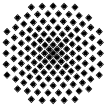
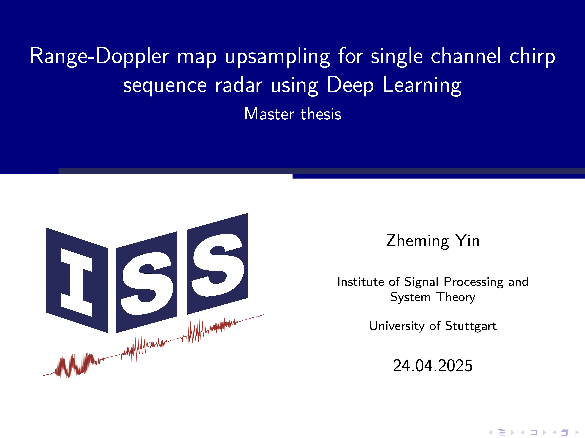

|                             |
|:-------------------------------------------------:|
|             **Universität Stuttgart**             |
| Institut für Signalverarbeitung und Systemtheorie |
|               Prof. Dr.-Ing. B. Yang              |
|                        |

# Master's thesis (D1513)

# Range-Doppler map upsampling for single channel chirp sequence radar using Deep Learning
## Student
| Name       | Zheming Yin            |
| ---------- | ---------------------- |
| Major      | Elektromobiliät (M.Sc) |
| Begin      | 01.10.2024             |
| End        | 31.03.2025             |
| Supervisor | Sven Hinderer          |

## Abstract
During the extensive usage of chirp sequence radar, it is often affected by the cost, system limit or regulations, resulting in limited resolution of the range-Doppler map. Meanwhile, the range-Doppler map collected in the indoor environment also puts higher requirements on the model in terms of complexity and high amplitude fluctuation, whereas the current upsampling approaches cannot meet this requirement well. Therefore, this thesis will combine the current upsampling models in the state of the art, such as Transformer and cGAN models, with a series of data processing methods, such as logarithm and normalization operations, and the combination of multiple loss functions to improve the quality of the super-resolution range-Doppler map. In addition, the environmental conditions and data in the public datasets about the range-Doppler map are currently simple, so the dataset of this thesis is collected in the indoor environment by ourselves. In the evaluation phase, we obtain an optimized combination of model, processing methods and loss functions and tune the hyperparameters of the model, which significantly improves the result compared to the other image upsampling approaches.

## Thesis

## Presentation

