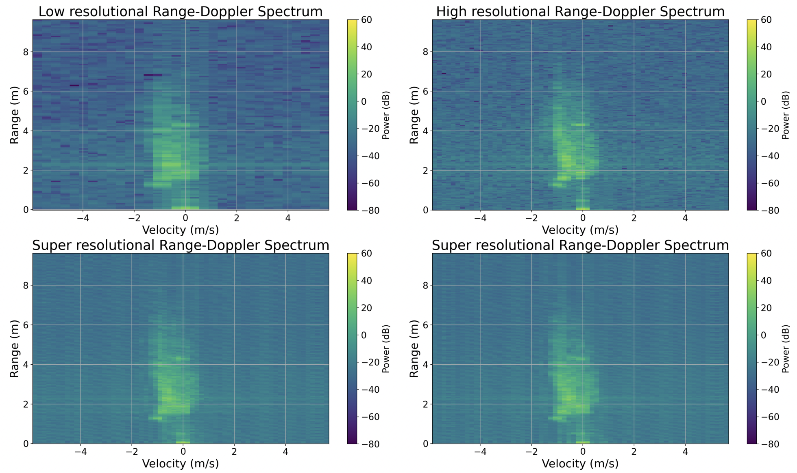
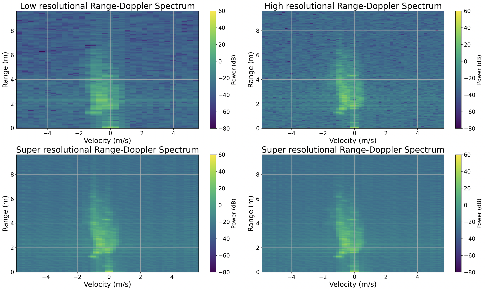

# How to use the code
There are two code folders in this source, "radar_sdk_new" and "rd_upsampling", as well as one folder saving evaluation checkpoints. The code "radar_sdk_new" is used to collect the dataset with the software development kit and the code "rd_upsampling" is the pipeline to upsample the range-Doppler map including the dataset loading, training, tuning and evaluation phases.
## Dataset collection
The file "radar.py" initializes the parameters of the hardware in the function "record_radar" and collects the frames by the function "get_radar_cube".

Some parameters should be changed:
+ The place of the measurement in the line 449.
+ The storage path in the line 456
+ The number of frames and times in the line 459, by default, once measurement contains 5 groups and each group has 8 consecutive frames.
+ Another initial parameters can be changed between the line 179 - 195, such as the index of the receivers, repetition time, frequency range and so on.
+ If more time interval to change the position, the time interval in the line 461 can be tuned as well.
## Range-Doppler map upsampling
To run it in the server, the command ```sbatch batch.sh``` can be used, where the file "batch.sh" obtain some configurations and can overwrite the initial settings during running. Otherwise, if on the local computer, run the file "main.py".
The default paths of the files:
+ The path of the collection: /data/public/rd_sr/dataset_2/
+ The path of the TFRecord files: /no_backups/d1513/tfrecord/
+ The path of the saving checkpoints: /no_backups/d1513/checkpoints/

Followings are specified for different phases, in order, dataset loading, training, evaluation and tuning.
### Dataset loading
During the dataset loading, two processes are split, namely TFRecord files creating and TFRecord files reloading, since the creating action costs much time.
#### TFRecord files creating
As the TFRecord files are created, some parameters and processings are determined already, such as the number of frames, the resampling rate and so on. Currently, there are already multiple types of the TFRecord files in the server, they are respectively:
+ train/test/val + "_factor2" with 4 frames and resampling rate as 2.
+ train/test/val + "_factor4" with 4 frames and resampling rate as 4.

If no changes in the settings of the TFRecord files creating, it's no need to re-run it. Otherwise, after setting the expected parameters in the "batch.sh" file, turn the ```main.create_tfrecords = True``` as true and remind to record a suffix name as the example ```main.tfrecord_suffix = '_factor2'```.

Note that the creation of the TFRecord files is based on the CPU, so the number of CPUs and the memory per CPU should be set higher.
#### TFRecord files reloading
The reloading process is automatical before the training phase. Remember to turn the ```main.create_tfrecords = False``` to false if possible and choose the files with the suffix.
### Training
The current settings are in default for the training process. Make sure that the setting ```main.type = 'Train'``` is train and check the ```main.model_name```, ```Trainer.loss_type```, ```processing_method```, etc. as the expectation. Note that if to update the WandB account, change your own WandB login key in the line 25 of the file "main.py".

As we finally choose the DP-TF Transformer model and use it as the generator in cGAN model, some settings and parameters are set already by default in the file "batch.sh". But still some could be changed according to the model and its scale shown followings. If only a data subset is used, the code can be modified in the line 462 in the file "utils/datasets.py" as ```ds_train.take(100)``` and remember to modify the learning rate schedule accordingly in the line 43 of file "train.py".

**DP-TF Transformer model**

| Scale | Small | Large |
|--------|:--------:|:---------:|
|```main.model_name```| DP-Transformer | DP-Transformer |
|```Trainer.learning_rate```| 0.0009137 | 0.0009137 |
|```batch_size```| 16 | 16 |
|```Trainer.loss_type```| ```lsd&frequency_domain``` | ```lsd&frequency_domain``` |
|```DPTransformerSTFT.num_dp_layers```| 1 | 2 |
|```DPTransformerSTFT.num_layers```| 1 | 3 |
|```DPTransformerSTFT.enc_kernel_size```| 3 | 5 |
|```DPTransformerSTFT.dec_kernel_size```| 1 | 2 |
|```DPTransformerSTFT.dff```| 64 | 88 |

**cGAN model** (The parameters of the generator is set as the previous table)

| Scale | Small | Large |
|--------|:--------:|:---------:|
|```main.model_name```| cGAN | cGAN |
|```ConditionalGAN.generator_name```| ```DP-Transformer``` | ```DP-Transformer``` |
|```ConditionalGAN.discriminator_scale```| ```small``` | ```large``` |
|```Trainer.learning_rate```| 0.0009137 | 0.0009137 |
|```batch_size```| 16 | 16 |
|```Trainer.loss_type```| ```lsd&frequency_domain``` | ```lsd&frequency_domain``` |

### Evaluation
After the training process, the evaluation can be done separately by restoring the saving checkpoints. There are two types of evaluation in the pipeline. One is to compare two specific checkpoints directly. Another is similar as the evaluation shown in the thesis, such as different models evaluation, training loss functions evaluation and so on, which has more cases or more checkpoints to be restored. Followings will explain two types separately. A recommandation for the evaluation is saving the checkpoints from the server and evaluating them in the local computer.

For the first type, namely two specific checkpoints, the uncommented code in the file "evaluation/evaluation.py" is by default for this type. Remember to turn the ```main.type = 'Test'``` as test, change two checkpoint paths in the configurations "```Evaluation.checkpoint_restore_path```", "```Evaluation.benchmark_checkpoint_path```" and their according model names in ```main.model_name``` and ```main.benchmark_model_name``` as well as the same parameters in the configuration as the training process. Note that if the benchmark model is the interpolation model, then the path "```Evaluation.benchmark_checkpoint_path```" can be written anyway.

The second type has to uncomment some codes in the file "evaluation/evaluation.py", now there are 6 other code blocks split by the block separator, except the code used in the first type. If needed, the code of the first type should be commented and according to the goal the other code blocks can be uncommented as the explanations at each beginning of the code block. Note that in this case, the ```main.type = 'Tune'``` should also turn as tune, the configuration ```Evaluation.checkpoint_restore_path``` should be renamed as ```Evaluation.checkpoint_restore_folder```, the name of the model is not changed in the config file but in the code block and the parameters of the evaluating model is also needed to be same as the training process. In the source folder, some previous checkpoints are saved, where the storage structure of the checkpoints in the folder can be followed as that or change the structure in the code block by yourself.

### Tuning
This pipeline can tune the hyperparameters of the model and training process using the sweep function of the tool WandB. The first step, turn the ```main.type = 'Tune'``` as tune and choose the model to be tuned in ```main.model_name```. The logic of the tuning process is that firstly the pipeline initializes the parameters from the config file "utils/config.gin" and then goes to the file "tune.py" to set the tuning process, in which the range of the hyperparameter list is determined. In order to make the configuration easy to modify, the additional configuration files can be created separately, such as the file "utils/config_tune_DP-Transformer.gin". The hyperparameters can be set in the "tune.py" and remove the default values of that from the new created gin file, like from "utils/config_tune_DP-Transformer.gin". Note that the hyper parameters of the training process can be added in the line 106 - 112 and that of the models can be added following, such as the line 122 - 129. The default count of the sweep trials is 5 times, but can be modified in the line 135.

# Result
The upsampling method specified for the range-Doppler map has been significantly improved. Here are some examples of the super-resolution range-Doppler maps attached, trained by the loss combination, best combination of the processing methods and the consecutive frames as the inputs.

**Trained by the DP-TF Transformer model** (left one in the second row) **and cGAN model** (right one in the second row) in the small scale with the data subset.


**Trained by the DP-TF Transformer model** (left one in the second row) **and cGAN model** (right one in the second row) in the large scale with the whole dataset.


**A visualization of the training process in the few early epochs**
